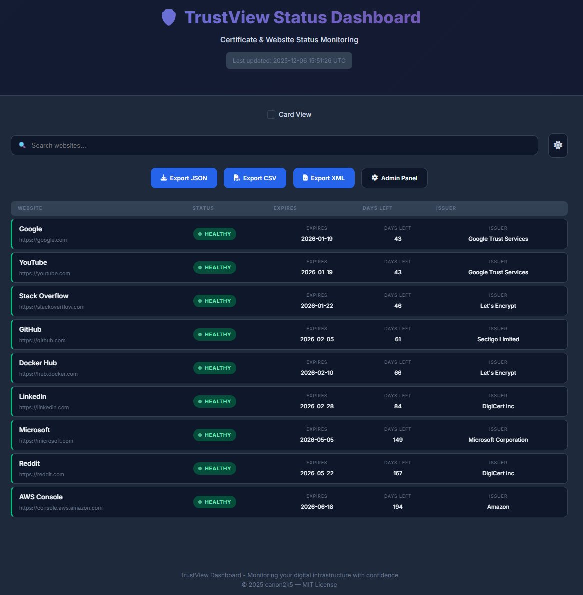
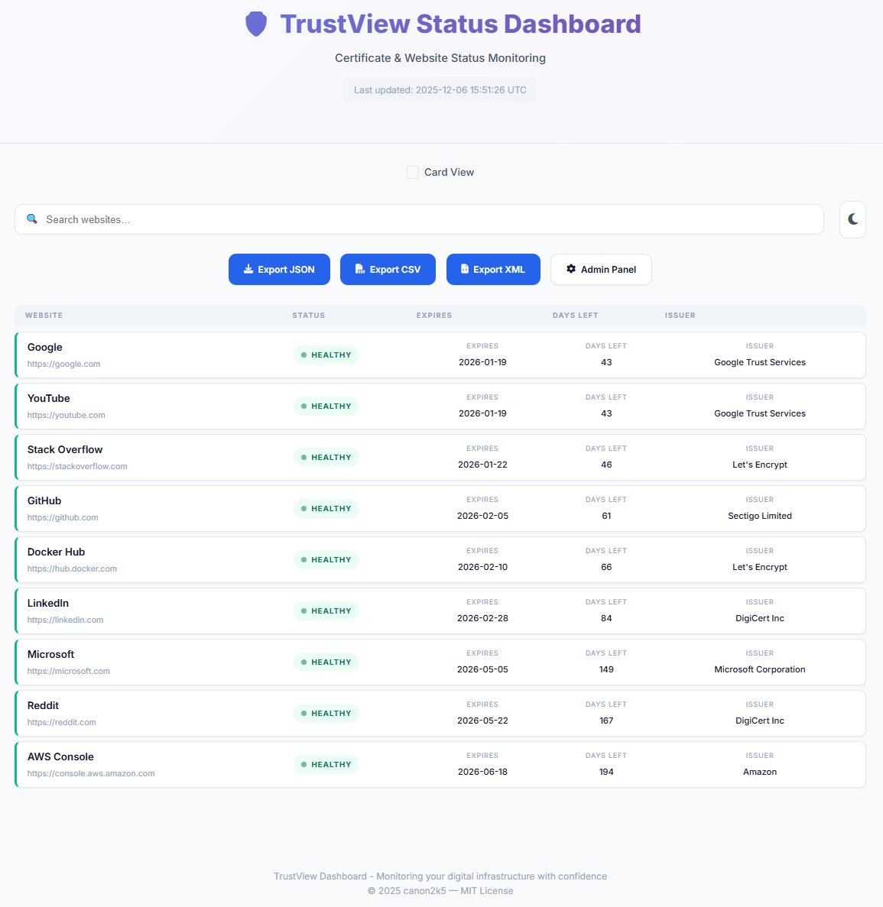
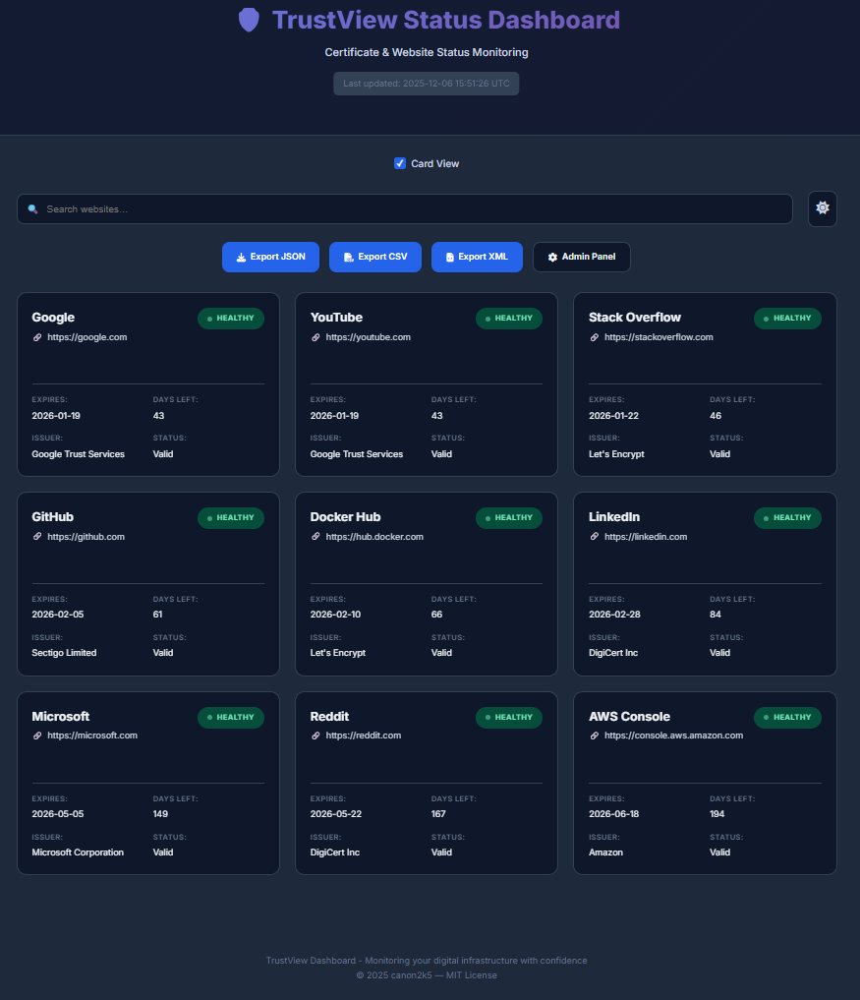
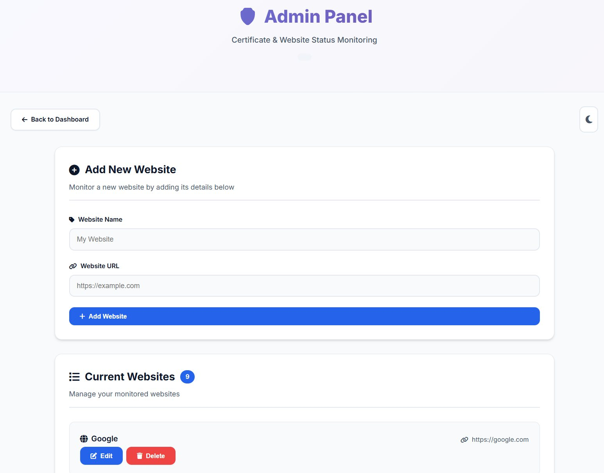

# TrustView / TrustCheck

TrustView is a lightweight certificate and website status dashboard. Point it at a list of sites (internal or public) and it will:

- Fetch HTTP and TLS information in parallel.
- Highlight upcoming certificate expirations.
- Export the full status table as JSON, CSV, or XML.
- Support custom CA bundles and selective SSL verification so you can monitor private/internal CA servers alongside public endpoints.

The app is built with Flask and stores configuration in a simple `websites.yml`, making it easy to deploy inside an ops network or bundle with existing tooling.

<p align="center">
  
  
</p>

<p align="center">
  
  
</p>

## Features

- **Dashboard & cards** – clean UI with search, card/grid toggle, and live timestamp.
- **Parallel status checks** – threaded worker pool (configurable) to keep refresh times low.
- **Certificate intelligence** – issuer, expiration date, days left, and severity tagging.
- **Internal CA support** – per-site CA bundle paths or automatic system bundle discovery; disable verification for lab gear when needed.
- **Admin interface** – protect changes behind a password (default hashed on first run).
- **Exports** – `/export.json`, `/export.csv`, `/export.xml` for downstream automation.

## Requirements

- Python 3.8+ (older versions work, but Python 3.6+ is recommended).
- System packages needed by `requirements.txt` (Flask, requests, bcrypt, PyYAML, etc.).

## Quick Start

```bash
python3 -m venv .venv
source .venv/bin/activate
pip install -r requirements.txt
python app.py
```

The server defaults to `127.0.0.1:5000`. Set `HOST`/`PORT` to expose it elsewhere.

## Configuration

Key environment variables:

| Variable          | Default | Description |
|-------------------|---------|-------------|
| `SECRET_KEY`      | random  | Flask session secret; set for production. |
| `FLASK_DEBUG`     | `true`  | Enables hot reload/logging. |
| `STATUS_THREADS`  | `8`     | Size of the thread pool for status checks. |
| `MAX_GAUGE`       | `500`   | Maximum value for dashboard gauges. |
| `HOST`/`PORT`     | `127.0.0.1`/`5000` | Listen address. |

## Managing Sites

Sites live in `websites.yml`. Example entry:

```yaml
websites:
  - name: Internal CA
    url: https://pki.internal.example.com
    ca_bundle: /etc/ssl/internal-ca.pem   # optional per-site CA
    verify_ssl: true                      # set false to disable verification
    timeout: 10                           # seconds (optional)
    auth:                                 # optional basic auth
      username: monitor
      password: s3cret!
```

- If `ca_bundle` points to a file, that bundle is used just for that site.
- If `verify_ssl` is `false`, SSL verification is skipped (useful for lab devices).
- Otherwise the app discovers the system CA bundle automatically, so private CA roots installed on the host are honored.

Restart the app or use the admin UI to reload changes.

## Admin Access

On first run, the app hashes a default admin password (`secret`) into `websites.yml`. Update it immediately by editing the YAML.

### Changing the Password

Edit `admin.password` inside `websites.yml` and set it to a plain string (for example `admin.password: myNewSecret`). On the next start, the app detects non-hashed values and replaces them with a bcrypt hash. Remember to restart the service and keep the file secured since it briefly contains plain text.

## Exporting Data

Download the current status from:

- `/export.json`
- `/export.csv`
- `/export.xml`

Each export contains the site name, URL, status, issuer, expiration date, and days remaining.

## Monitoring Internal CA Servers

- **Custom bundles:** Put your internal CA PEM file on disk and use the `ca_bundle` key for the corresponding site. This allows monitoring endpoints signed by private roots without touching global trust stores.
- **System detection:** When no custom bundle is supplied, `utils.get_system_ca_bundle()` inspects common paths (Debian, RHEL, macOS, etc.) and falls back to `certifi`. Deploy the app on a host that already trusts your internal CAs to automatically cover those endpoints.
- **Verification toggle:** `verify_ssl: false` is available for edge cases (lab appliances, staged revocations). Use sparingly.

With these controls, TrustView can mix public and private infrastructure in a single dashboard while keeping certificate telemetry consistent.

## License

MIT License © canon2k5.
