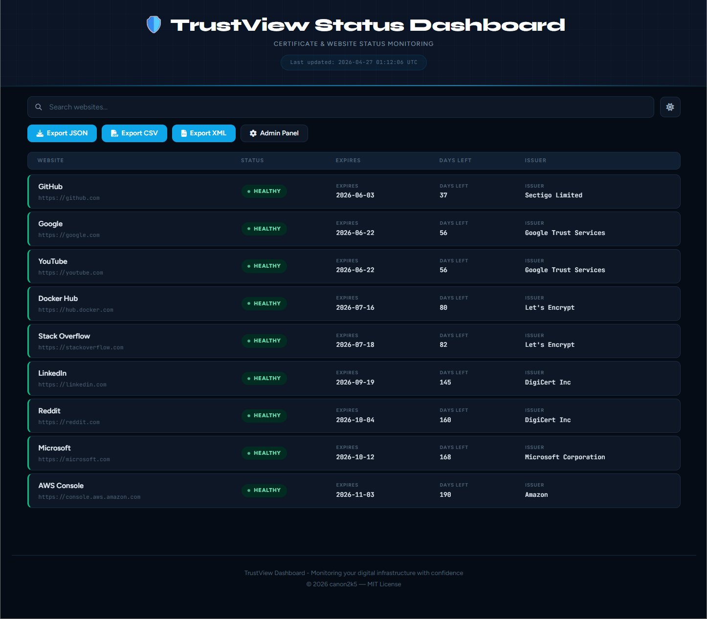
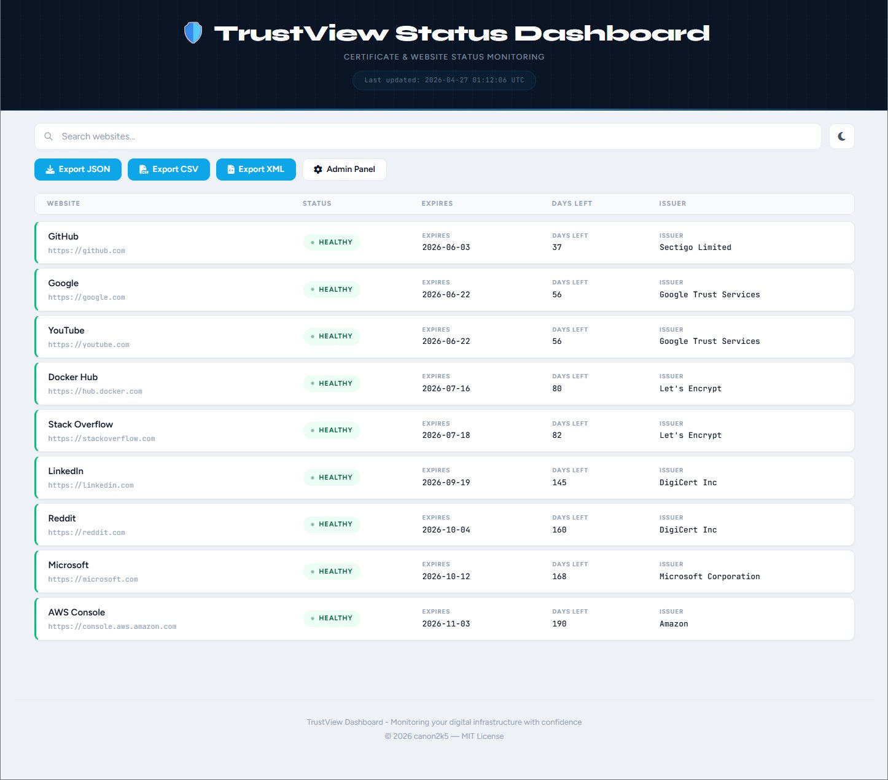
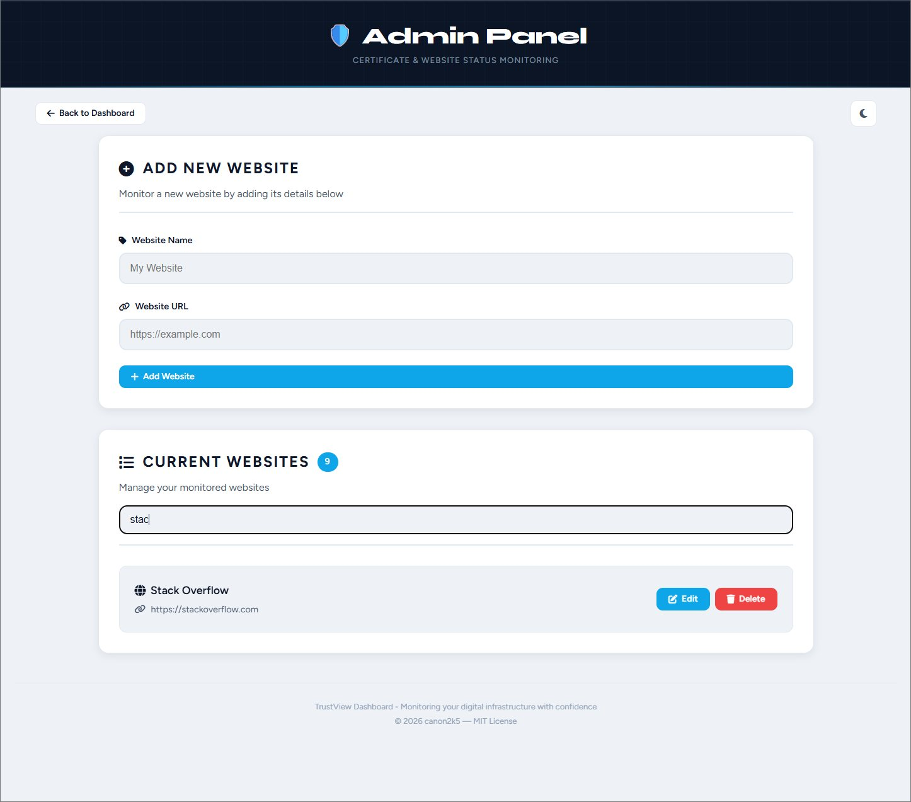

# TrustView

TrustView is a lightweight certificate and website status dashboard. Point it at a list of sites (internal or public) and it checks HTTP reachability and TLS certificate health in parallel, surfacing expiration warnings before they become incidents.

Built with Flask. Configuration lives in a single `websites.yml` file — easy to deploy inside an ops network or alongside existing tooling.

<p align="center">
  
  
</p>

<p align="center">
  
</p>

## Features

- **Live status dashboard** — list view with color-coded severity, sortable by any column (name, status, expiry, days left, issuer)
- **Search** — filter by site name, URL, or certificate issuer in real time
- **Certificate intelligence** — issuer, expiration date, days remaining, and automatic severity tagging (healthy / expiring / critical)
- **Daily auto-refresh** — page reloads once every 24 hours automatically
- **Parallel checks** — threaded worker pool keeps the dashboard fast regardless of site count
- **Internal CA support** — per-site CA bundle paths or automatic system bundle discovery; disable verification for lab gear when needed
- **Admin panel** — add, edit, and delete sites behind a password-protected interface with its own search filter
- **Exports** — `/export.json`, `/export.csv`, `/export.xml` for downstream automation

## Requirements

- Python 3.8+
- Dependencies: Flask, PyYAML, bcrypt, requests

## Quick Start

```bash
python3 -m venv .venv
source .venv/bin/activate
pip install -r requirements.txt
python app.py
```

The server defaults to `127.0.0.1:5000`. Open that address in a browser.

## Environment Variables

| Variable         | Default       | Description                                          |
|------------------|---------------|------------------------------------------------------|
| `SECRET_KEY`     | random        | Flask session secret — set a fixed value in production |
| `FLASK_DEBUG`    | `true`        | Enables hot reload and debug logging                 |
| `STATUS_THREADS` | `8`           | Thread pool size for parallel status checks          |
| `HOST`           | `127.0.0.1`   | Listen address                                       |
| `PORT`           | `5000`        | Listen port                                          |

## Managing Sites

Sites live in `websites.yml`. The admin panel at `/admin` lets you add, edit, and delete them without touching the file directly.

For advanced options, edit `websites.yml` by hand:

```yaml
websites:
  - name: Internal App
    url: https://app.internal.example.com
    ca_bundle: /etc/ssl/internal-ca.pem   # optional: per-site CA bundle
    verify_ssl: true                      # set false to skip verification
    timeout: 10                           # request timeout in seconds
    auth:                                 # optional HTTP basic auth
      username: monitor
      password: s3cret!
```

- **`ca_bundle`** — path to a PEM file used only for this site; useful for private CA roots without touching global trust stores.
- **`verify_ssl: false`** — skips certificate verification entirely; use only for lab devices or staged environments.
- **No custom bundle** — the app automatically discovers the system CA bundle (Debian, RHEL, macOS, etc.) and falls back to `certifi` if none is found.

## Status Severity

| Status     | Meaning                              |
|------------|--------------------------------------|
| `healthy`  | Certificate valid, more than 30 days remaining |
| `expiring` | Certificate expires within 30 days   |
| `critical` | Certificate expires within 7 days or already expired |
| `error`    | Certificate could not be retrieved   |

## Admin Access

Navigate to `/admin` and log in. On first run the default password is `secret` — change it immediately.

### Changing the Password

Set `admin.password` in `websites.yml` to a plain string:

```yaml
admin:
  password: myNewPassword
```

On next startup the app detects the plain-text value, replaces it with a bcrypt hash, and saves the file. Keep `websites.yml` secured since it briefly contains plain text during this process.

## Monitoring Internal CA Servers

TrustView is designed to mix public and private infrastructure in a single dashboard.

- **Custom bundles** — put your internal CA PEM file on disk and set `ca_bundle` for the relevant site. The certificate is verified against that bundle only, without touching the global trust store.
- **System bundle discovery** — when no custom bundle is set, the app inspects common OS paths (Debian/Ubuntu, RHEL/CentOS, macOS, Alpine, FreeBSD) and falls back to `certifi`. If your host already trusts your internal CA, those endpoints are covered automatically.
- **Verification toggle** — `verify_ssl: false` is available for edge cases such as lab appliances or staged certificate revocations. Use sparingly.

This means a single TrustView instance can monitor both public endpoints and private infrastructure behind a corporate CA with consistent certificate telemetry across the board.

## Exports

The current status snapshot is available at:

- `/export.json`
- `/export.csv`
- `/export.xml`

Each record contains site name, URL, status, issuer, expiration date, and days remaining.

## License

MIT License © canon2k5
